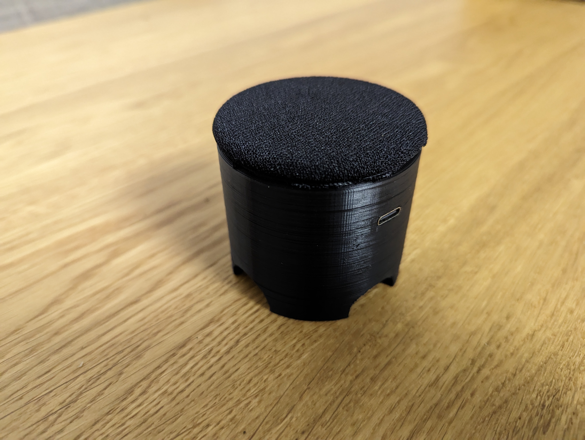

## HomeAssistantSpeaker

It is a small, 3D printable rhasspy satellite. It uses INMP441 microphone, MAX98357A audio amplifier paired with 8 Ohm 0.5 W broadband speaker, NeoPixel led strip and ESP32. It is powered from 5V USB.

## What you need

Running [Rhasspy](https://rhasspy.readthedocs.io/en/latest/) instance

To build it you will need:
* 3D printed speaker housing  - [stl file](.Mechanics/HomeAssistentSpeaker.stl)
* PCB - [KiCad Project](./Hardware/)
* 8 Ohm 0.5 W 50 mm broadband speaker
* NeoPixel led strip - Optional
* INMP441
* MAX98357A
* ESP32 - module itself
* LM1117-3.3
* USB connector - 6 pin
* a few passive components - resistors and capacitors

And most important **Soldering skills**

## Assambly

* Solder everything together

* Put it inside the shell (order from the bottom: speaker, board, led strip)

* Add speaker mesh fabric

## Demo
